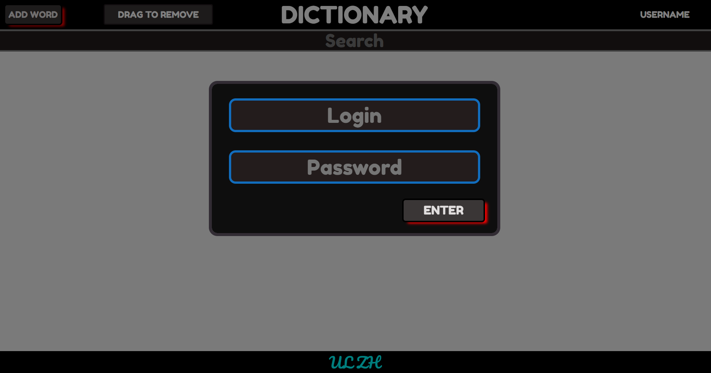
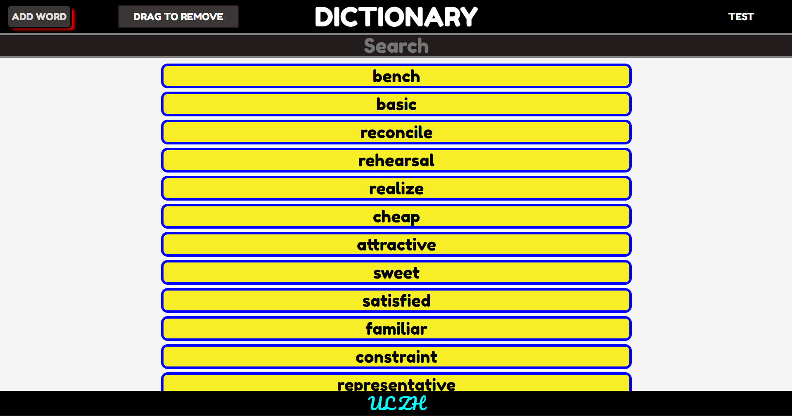
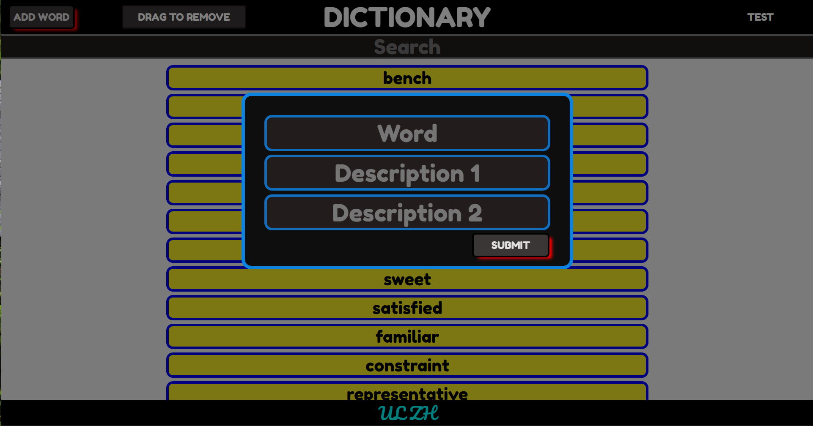

# Dictionary Front-end (so far) application based on React and Redux
## To start the application
### cd client
### npm i react-scripts
### npm start
## To check functionality
###  login: test
###  pass: test

